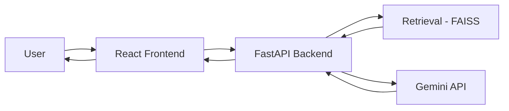

https://github.com/Singhsaditya/Finance-Tutor# Project - High Level Design (HLD)

## Project Title
Finance Tutor (RAG-based AI Learning Assistant)

## Course Name
Medicaps University - Datagami Skill Based Course

## Institution Name
Medicaps University

## Student Name(s) & Enrolment Number(s)
- Student 1: TBD (Enrolment: TBD)
- Student 2: TBD (Enrolment: TBD)
- Student 3: TBD (Enrolment: TBD)

## Group and Mentors
- Group Name: TBD
- Project Number: TBD
- Industry Mentor Name: TBD
- University Mentor Name: TBD
- Academic Year: 2025-26

## Table of Contents
1. Introduction
2. Scope of the Document
3. Intended Audience
4. System Overview
5. System Design
6. Application Design
7. Process Flow
8. Information Flow
9. Components Design
10. Key Design Considerations
11. API Catalogue
12. Data Design
13. Data Model
14. Data Access Mechanism
15. Data Retention Policies
16. Data Migration
17. Interfaces
18. State and Session Management
19. Caching
20. Non-Functional Requirements
21. Security Aspects
22. Performance Aspects
23. References

## 1. Introduction
Finance Tutor is a full-stack learning platform that helps users understand finance topics through question answering, quiz generation, answer evaluation, and guided teaching. It uses Retrieval-Augmented Generation (RAG) with a local FAISS index and Google Gemini for embeddings and text generation.

## 2. Scope of the Document
This HLD defines the architecture, key components, data flow, API contracts, and non-functional design of the Finance Tutor system. It covers local/dev deployment and design choices currently implemented in the repository.

## 3. Intended Audience
- Project evaluators and mentors
- Backend and frontend developers
- QA/test engineers
- DevOps/deployment owners

## 4. System Overview
The system contains:
- React frontend (`frontend/`) for user interaction
- FastAPI backend (`backend/`) exposing APIs
- Ingestion pipeline to create vector index from text files (`data/*.txt`)
- FAISS index and metadata persisted in `vector_db/`
- Gemini SDK integration for LLM and embedding calls

High-level interaction:
1. User submits request from UI.
2. Frontend calls backend REST APIs.
3. Backend retrieves relevant context from FAISS where needed.
4. Backend builds prompts and calls Gemini.
5. Backend returns structured JSON response to UI.

## 5. System Design
Architecture style: 3-tier application with AI service integration.

- Presentation Layer: React SPA
- Application Layer: FastAPI routes + domain logic
- Data/Knowledge Layer: Local documents, FAISS index, metadata JSON
- External AI Service: Google Gemini APIs

Deployment target (current): local host
- Frontend: `http://localhost:3000`
- Backend: `http://127.0.0.1:8000`

## 6. Application Design
Backend modules:
- `main.py`: API routes and CORS configuration
- `ingestion.py`: reads source text, chunks it, creates embeddings, writes FAISS + metadata
- `retrieval.py`: vector search for top-k contexts
- `rag_engine.py`: ask flow prompt builder + answer generation
- `quiz_generator.py`: quiz JSON generation
- `answer_evaluator.py`: answer scoring JSON generation
- `teaching_engine.py`: concept teaching JSON generation
- `_gemini_client.py`: unified Gemini client abstraction

Frontend modules:
- `App.jsx`: workspace layout + tab navigation
- `pages/Chat.jsx`: ask tutor flow
- `pages/Quiz.jsx`: quiz generation and local answer checking for MCQs
- `pages/Evaluate.jsx`: answer evaluation flow
- `pages/Teach.jsx`: teaching assistant flow
- `lib/api.js`: Axios API client

## 7. Process Flow
### 7.1 Ingestion Process
1. Read files from `data/*.txt`.
2. Split into chunks (approx 1200 chars).
3. Generate embeddings using Gemini embedding model.
4. Build FAISS `IndexFlatL2`.
5. Save index (`faiss_index.idx`) and metadata (`metadata.json`).

### 7.2 Ask Tutor Process
1. User enters question.
2. Backend retrieves top-k relevant chunks.
3. Prompt includes retrieved context + question.
4. Gemini generates concise answer.
5. UI shows answer and context chunks.

### 7.3 Quiz Process
1. User chooses topic/top_k.
2. Backend retrieves context.
3. Gemini returns quiz JSON with MCQs and short answers.
4. UI renders MCQs and checks selected answer against `answer_index`.

### 7.4 Evaluate Process
1. User sends question + answer (+ optional reference).
2. If reference is missing, backend retrieves context.
3. Gemini returns score/correctness/explanation JSON.
4. UI displays scoring output.

### 7.5 Teach Process
1. User sends concept + reference.
2. Gemini returns explanation/example/next_topic JSON.
3. UI shows guided learning output.

## 8. Information Flow

## 9. Components Design
- Frontend component: input forms, output cards, loading/error states
- API gateway component: FastAPI endpoints and request validation
- Retrieval component: loads index and returns top-k contexts
- Prompt/LLM component: builds constrained prompts and parses JSON outputs
- Index persistence component: manages FAISS and metadata files

## 10. Key Design Considerations
- Simplicity: local index and plain JSON metadata for easy setup
- Extensibility: separate engines for ask/quiz/evaluate/teach
- Reliability: fallback parsing for malformed LLM JSON
- Portability: env-driven model and path configuration
- Explainability: return retrieved context in `/ask` response

## 11. API Catalogue
Base URL: `http://127.0.0.1:8000`

### 11.1 `GET /status`
- Purpose: health check
- Response: `{ "status": "ok" }`

### 11.2 `POST /ask`
- Request: `{ "question": "string" }`
- Response: `{ "question": "...", "answer": "...", "contexts": ["..."] }`

### 11.3 `POST /quiz`
- Request: `{ "topic": "string", "top_k": 5 }`
- Response: quiz JSON with `mcqs` and `short_answer`

### 11.4 `POST /evaluate`
- Request: `{ "question": "string", "user_answer": "string", "reference": "optional" }`
- Response: `{ "score": 0-10, "correctness": true/false, "explanation": "...", "improvement_tip": "..." }`

### 11.5 `POST /teach`
- Request: `{ "concept": "string", "reference": "string" }`
- Response: `{ "explanation": "...", "example": "...", "next_topic": "..." }`

## 12. Data Design
Primary data artifacts:
- Source corpus: plaintext finance documents (`data/*.txt`)
- Vector index: FAISS binary (`vector_db/faiss_index.idx`)
- Metadata: JSON with chunk details (`vector_db/metadata.json`)
- Runtime config: `.env`

## 13. Data Model
### 13.1 Metadata Record
- `doc_id` (int): source document identifier
- `chunk_id` (int): chunk index within document
- `text` (string): stored preview/content for retrieval output

### 13.2 Quiz (LLM Output)
- `mcqs`: list of `{id, question, options[4], answer_index, explanation?}`
- `short_answer`: list of `{id, question, reference_answer}`

### 13.3 Evaluation (LLM Output)
- `score` (0-10)
- `correctness` (boolean)
- `explanation` (string)
- `improvement_tip` (string)

## 14. Data Access Mechanism
- Ingestion writes FAISS and metadata files to disk.
- Retrieval loads index from disk on request and performs vector search.
- Metadata lookup uses in-memory JSON list loaded per request.
- No relational/NoSQL database is currently used.

## 15. Data Retention Policies
Current behavior:
- Index and metadata persist until manually overwritten/deleted.
- No automatic expiry for stored chunk metadata.
- No user profile/session data persisted by backend.

Recommended policy:
- Rebuild index when source corpus changes.
- Version index artifacts by date/build id in production.
- Remove sensitive data from source `.txt` before ingestion.

## 16. Data Migration
Current migration approach:
- Re-run `python backend/ingestion.py` after corpus/model/path changes.

Future migration approach:
- Keep versioned index directories.
- Validate embedding dimension compatibility before loading old index.
- Provide migration script for metadata schema changes.

## 17. Interfaces
### 17.1 User Interface
- SPA with 4 function pages: Ask, Quiz, Evaluate, Teach
- Form-based interaction
- Displays API responses and user-readable errors

### 17.2 Backend Interface
- REST JSON APIs over HTTP
- Pydantic request schemas
- CORS allows local frontend origins (`localhost:3000`, `127.0.0.1:3000`)

### 17.3 External Interface
- Gemini API via `google-genai` / fallback package
- Model names configured via env (`EMBEDDING_MODEL`, `LLM_MODEL`)

## 18. State and Session Management
- Frontend state is component-local (`useState`) and transient.
- Backend is stateless per request.
- No login/session token mechanism implemented.

## 19. Caching
Current:
- No explicit application cache layer.
- Index file acts as precomputed retrieval artifact.

Recommended:
- Cache retrieval results for repeated questions.
- Cache model responses for idempotent prompts in production.

## 20. Non-Functional Requirements
- Availability: local development uptime during active sessions
- Reliability: robust JSON extraction fallback for LLM outputs
- Maintainability: modular backend service files
- Usability: simple tab-based UX
- Portability: environment-variable based configuration

## 21. Security Aspects
Current controls:
- API key managed via environment variable (`GEMINI_API_KEY`)
- `.env` ignored in git
- CORS restricted to local dev origins

Risks and recommendations:
- Rotate any exposed API keys immediately.
- Add request rate limiting for public deployments.
- Add authentication/authorization before internet exposure.
- Add input length limits and validation hardening.
- Avoid logging sensitive user-provided content.

## 22. Performance Aspects
Current performance factors:
- Retrieval uses FAISS `IndexFlatL2` (fast for small/medium corpora)
- LLM response latency dominates total request time
- Index loaded on each retrieval call may increase latency

Optimization recommendations:
- Keep FAISS index loaded in process memory at startup.
- Use approximate FAISS indexes for very large corpus.
- Use async calls and worker scaling for concurrent users.
- Add monitoring for p50/p95 API latency.

## 23. References
- Project repository structure and source files under `finance_bot/`
- FastAPI documentation: https://fastapi.tiangolo.com/
- FAISS documentation: https://github.com/facebookresearch/faiss
- Google GenAI SDK: https://ai.google.dev/
- React documentation: https://react.dev/
